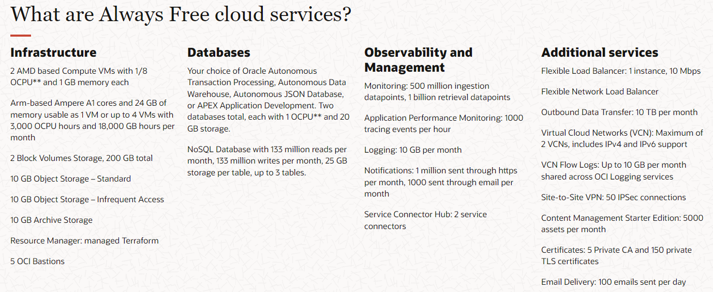
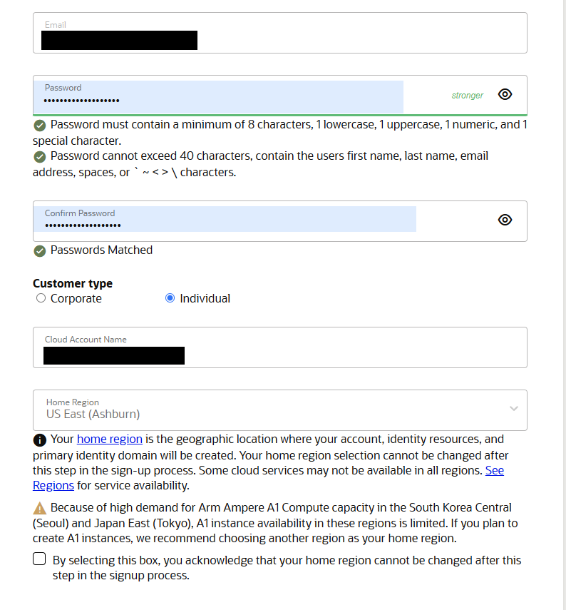
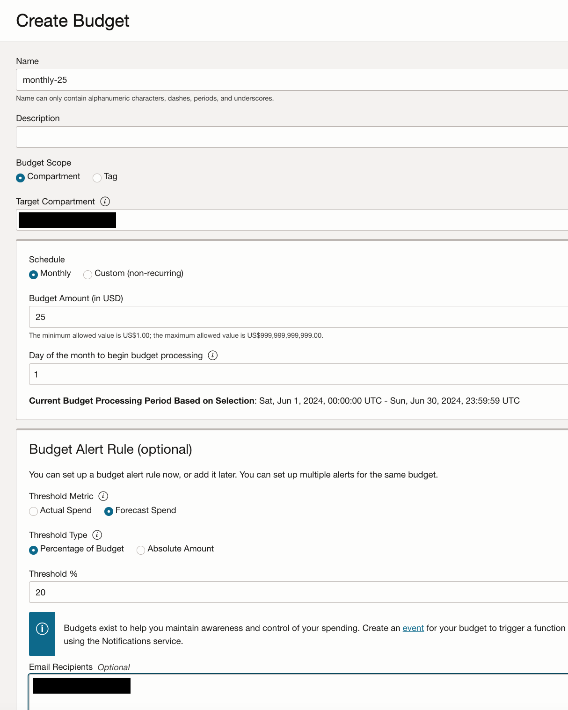

# OKE Up & Running series
* [Part 1](): Signing up for Oracle Cloud (You are here)
* [Part 2](): Deploy the infrastructure 
* Part 3: Coming soon
***
I often see people asking for advice on how to get hands-on practice with Kubernetes in a cloud environment, but understandably, they don't want to spend much money. While it's true that the long-term cheapest way to run K8s is on a spare computer at home, there are also some shortcomings - upgrades can be trickier, autoscaling is next to impossible, if you want to access your cluster from the public internet you might not want to expose your home network's public IP address (or might not know how to do so securely), and many more. Also, if your goal in doing this is to get a job in DevOps or SRE you might want to work with cloud-hosted services alongside your Kubernetes cluster.

All the major cloud providers offer free trials with some amount of credits, but once those expire it can be very easy to accidentally rack up an unexpected bill. There are affordable options if all you want is a reasonably-priced cluster, like Digital Ocean or Linode, but these aren't used very often at large scale so I wouldn't necessarily recommend these for people interested in learning broader cloud skills.

One option that gets recommended is Oracle Cloud (OCI). It has the most generous free tier, but is usually overlooked likely because Oracle Cloud doesn't have anywhere near the market share of the other major providers (AWS, Azure, GCP) so most people aren't very comfortable with using it. Additionally, there's a lot of confusion out there around what exactly you get with the Always Free resources. 

The goal of this guide is to clear up some of the confusion and then walk through how to get a fully cloud-managed Kubernetes cluster (OKE) running in Oracle Cloud that will be entirely covered by the Always Free limits. I'll be sure to highlight any areas where there is a risk of exceeding these free limits without realizing it. The purpose of this particular guide won't be to teach you how to use Kubernetes, but some of the basic concepts will come up as I explain some of the architectural decisions.

## Oracle Free Tier
> :warning: The terms of the Oracle Cloud Always Free tier can change at any time. I do my best in this guide to recommend resources and configurations that will not incur any costs as of the time of this writing. I make no guarantees and take no responsibility for any charges accrued in your personal Oracle Cloud accounts, or termination of your account for violating Oracle's policies. Always set up reasonable billing alerts, follow all of Oracle's terms and conditions, and read the official documentation before deploying any new cloud resources.

Oracle Cloud's free tier offering is broken into two categories - Always Free resources, and a 30-day $300 USD credit that applies to any services you want to try out. I am only going to focus on the Always Free category, because I assume the reader wants to use whatever they set up for more than 30 days.

### Always Free
Always Free is a subset of OCI services that are, within defined limits (as the name suggests), **always free** for all customers.

You can find the full list [here](https://www.oracle.com/cloud/free/#free-cloud-trial) by filtering the **tier type** on "Always Free". There is more detailed documentation on specific services [here](https://docs.oracle.com/en-us/iaas/Content/FreeTier/freetier_topic-Always_Free_Resources.htm).

As you can see, this is pretty generous - 200GB of compute storage, 2 free VCNs (Virtual Cloud Network), VMs with up to 4 vCPUs and 24GB of RAM, and more - all free to use as long as you want! There are some caveats here that I'll cover a bit later, but you definitely do get a lot to work with.

## Getting Started
In this section we'll walk through creating a free tier account and then upgrading it to a paid account to unlock all features and capabilities we'll need later on. If you already have your own account feel free to skip the rest of this post and move on to Part 2.

### Signing up
Before we can start using the free tier we need to make an account. Be aware that you will need a valid credit card to complete this section. There will only be a pre-authorization and you won't actually be charged any money.

First, we will go to [oracle.com/cloud/free](https://www.oracle.com/cloud/free/) and register. It's pretty basic and just asks for your location, name, and e-mail address. Once you submit you will get a verification email sent to you. When you receive the verification email, click the link in it and finish registering.

Generate a strong password (this will be used for your account root user login), select "Invdividual" for the customer type, and set your home region. I recommend whatever is closest to you geographically. You can also change your preassigned cloud account name if you wish. Once complete, hit **Continue**.

At the next screen you will enter your personal contact information as well as do the payment/ID verification. As stated above, you will not be charged any money, this is just a fraud prevention measure to prevent people from abusing the free tier.

Finish the setup process and then you will be taken to the sign-in page and can log into your account!

### Upgrade your account
At this point you can start using whatever (free-tier) services you'd like. However, you may run into capacity limits as the free tier users are a lower priority than paid users. This means that depending on utilization in your preferred region, you may not actually be allowed to deploy certain resources when you want them. Additionally, I've heard anecdotally online that free tier users can have their resources like Virtual Machines shut down without warning when they are idle for a certain amount of time.

To get around this we will convert our free trial to a paid account. Don't worry - as long as you stay within the Always Free limits you will still not have to pay anything.

Before we do any of this I would highly encourage you to enable Multi-factor authentication on your account. Since we'll be upgrading your account to Pay-as-you-go, anyone who gets a hold of your password could start racking up charges in your account. To do this, click the user profile icon in the top right of your browser window from inside the OCI console, and click "My Profile". Click the "Security" button and enable 2-step verification using the authenticator of your choice.

Next, we'll setup a budget alert so we can get notified if we start accruing charges, before things get out of control. From the hamburger menu in the top left, choose **Billing & Cost Management** and then click "Budgets" under **Cost Management**.

Click "Create Budget" and set up the budget and alert however you want, based on what you are comfortable with. I have mine set to $25 monthly, with an alert being sent when I'm forecasted to spend 20% of that ($5). Add your email as an Email Recipient so you'll be notified when the alert is triggered.

> :warning: Please note that setting a budget will NOT prevent you from being charged more than the budget amount, it will only help to warn you when you start to accrue charges.

Finally, to upgrade your account, go back to the hamburger menu, select **Billing & Cost Management** again, and click "Upgrade and Manage Payment". On the Upgrade page, confirm that all your details are correct, and proceed with the upgrade.

From this point on you are responsible for paying for any resources you use that exceed the Always Free tier, or that are not included in it.

## Conclusion
That's it! Your OCI account setup is complete and you can now start using services. In [Part 2]() I will walk through creating the infrastructure that your cluster will run on.
