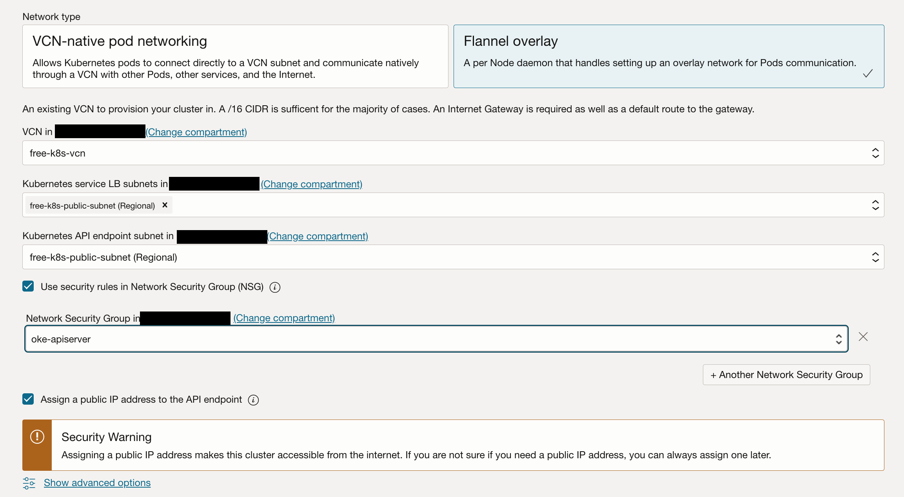

# OKE Up & Running series
* [Part 1](): Signing up for Oracle Cloud
* [Part 2](): Deploy the infrastructure (You are here)
* Part 3: Coming soon
***
This is the 2nd part of our series on running a completely free multi-node Kubernetes cluster in Oracle Cloud. If you haven't already read [Part 1]() I'd recommend starting there.

## Summary
We've successfully created an Oracle Cloud (OCI) account and upgraded it to Pay-As-You-Go billing to remove any limitations on what we're able to use. Now we get to move onto the fun part of actually building something.

In this section I'll walk through creating all of the cloud infrastructure that our cluster will run on. You can do all of these steps via the web console if you'd like, but I would highly recommend using some flavor of Infrastructure as Code (IaC) so that you can easily recreate things if (when) they break, or if you're troubleshooting and want to return to a known-good configuration at any point in time. I used Terraform for my own account, but in this guide I'll do everything in the console so anyone can use it as a starting point.

## VCN
Before we can deploy anything, we need a Virtual Cloud Network (VCN) for it to run in. I won't get too deep into how cloud networking works, but this is a private network within Oracle Cloud that only you control. In AWS and GCP it's called a Virtual Private Cloud (VPC), and in Azure it's a Virtual Network (VNet).

As we saw in Part 1, OCI lets you have up to 2 VCNs completely free. We'll only need one in this case.

### Create the VCN
Creating the VCN itself is pretty straightforward. When you're logged into the OCI console, click the hamburger menu, then **Networking** and then "Virtual cloud networks". Click "Create VCN" and fill in the form.

* **Name**: give it whatever name you'd like
* **IPv4 CIDR Blocks**: We only need 1 CIDR Block, I'd recommend something large like a `/16`. We will be creating subnets within this range so you want it large enough to encompass them.
Everything else can be left on the default settings.

The VCN should appear as soon as you click the "Create" button. Click on it in the Virtual Cloud Networks list to proceed with the configuration.

### Network Configuration
Once you've created the VCN you'll need to add all the necessary components for it - internet gateway, NAT gateway, subnets, route tables, security lists, etc. Luckily, OCI has an entire page with [recommended network configurations](https://docs.oracle.com/en-us/iaas/Content/ContEng/Concepts/contengnetworkconfigexample.htm) for different possible cluster setups, which we'll use to eliminate some of the guesswork.

I won't walk through how to create each of these as that would take forever, but everything you need to create here will be a sub-resource of your VCN and can be found under "Resources" in the sidebar. 

In my cluster I chose to use the "Flannel CNI plugin, public API endpoint, private worker nodes, and public load balancers" design (Example 1 in the link above). I keep my cluster API endpoint secure by only allowing internet ingress from my home public IP address. You can choose whichever architecture you'd like but later on in the tutorial there might be some things you have to do slightly differently.

If you decide to keep the Kubernetes API endpoint private you will need to deploy a [Bastion](https://docs.oracle.com/en-us/iaas/Content/Bastion/home.htm) or other solution like a VPN in order to access your cluster from your home computer (you get 5 free bastions so this won't cost you anything if you go this route). Since it is a dedicated service it also won't count against the number of free VM instances you can use. I won't be covering how to setup the bastion to connect to your cluster but there is documentation available[^1].

[^1]: https://docs.oracle.com/en-us/iaas/Content/ContEng/Tasks/contengsettingupbastion.htm
#### A note on Security Lists and Network Security Groups
You'll notice that VCNs offer both Security Lists and Network Security Groups (NSGs). Security Lists are the original form of firewall in OCI, and apply to all endpoints within a subnet. Network Security Groups are a newer concept, and apply to specific resources that you assign them to. 

You may want to consider using NSGs for some of the recommended security rules if you think that you might eventually want to run other VM instances or services in your subnets than just OKE nodes. This way the rules that are Kubernetes-specific, like "Allow Kubernetes control plane to communicate with worker nodes." will only apply to your worker nodes, and not other servers in the same subnet. It's entirely up to you how you choose to divide them up.

## OKE Cluster
Now for the moment you've been waiting for!

Quick note here - you might have noticed that the Always Free services list doesn't say anything about Oracle Kubernetes Engine (OKE). This seems to be the reason that most tutorials out there walk you through manually building a Kubernetes cluster from scratch on the free compute instances. The downside here is that you end up dedicating some of your limited free instances to being control plane nodes. Sure, you can configure control plane nodes to run workloads as well, but things like the api-server and etcd still consume valuable resources. It turns out that if you deploy a Basic-tier OKE cluster, the control plane fee is waived[^2]. This allows you to have a completely managed cluster, while saving all of your free compute instances to run your workloads. You do miss out on some advanced features by using Basic clusters, but none of them are super important for personal use.

[^2]: https://www.oracle.com/cloud/cloud-native/container-engine-kubernetes/pricing/

To create our cluster, navigate to the **Containers & Artifacts** dashboard in the console. You can also find it under **Developer Services > Containers & Artifacts** in the hamburger menu. Click "Create cluster" and then select "Custom create".

Give your cluster a name and press "Next". You can optionally view the advanced options and change them, but the default settings are perfectly fine. On the next page you'll configure the network settings based on the example config you decided to use in the **VCN** section of this post.

* **Network type**: Be sure this matches the network type you chose to use (Flannel or OCI CNI).
* **VCN**: Select the VCN you created earlier
* **Kubernetes service LB subnets**: This is the subnet where any `LoadBalancer` type Services you create in your cluster will be deployed. Depending on your network config you chose you either want a public or private subnet.
* **Kubernetes API endpoint subnet**: Choose a subnet based on whether you want public or private access to the cluster API endpoint.
* **Use security rules in Network Security Group**: Optionally attach an NSG to the cluster API endpoint.
  * **Network security group**: Choose the NSG you want to attach the the API endpoint
* **Assign a public IP address to the API endpoint**: Self-explanatory - you cannot access a *public* API endpoint without enabling this. If you want your API endpoint to stay private leave this unchecked.

On the next page, you will configure the node pool for your cluster.
> :warning: This page is where you're most likely to accidentally configure something that will end up costing you money. When in doubt refer to the Always Free limits, and the official documentation.

* **Version**: Select the current cluster version
* **Node Placement Configuration**:
  * If you chose the OCI CNI for your cluster you will have the option of either Managed or Virtual nodes. You must choose Managed nodes to get a free cluster, as selecting Virtual will force it to be "Enhanced", which comes with a control plane charge.
  * You can define multiple availability domains if you want to add some extra resiliency in case there's an issue in your region. Choose your private worker node subnet you created earlier, and under Advanced options, set the "Capacity type" to "On-demand capacity" for all availability domains you create.
* **Shape and Image**:
  * **Node shape**: In Always Free you get specific sizes of AMD and Arm instances. I would recommend going with Arm for the worker nodes as you get more resources and most Kubernetes-based tools nowadays support arm64 architectures.
    * **Always Free Arm shape**: VM.Standard.A1.Flex
    * **Always Free AMD shape**: VM.Standard.E2.1.Micro
  * **Resources**: Select the number of OCPUs and Memory *per node*. Make sure you stay within the Always Free limits - for example, if you're using Arm instances and want 3 nodes, you have to make sure to give them 8GB of memory or less (`24GB / 3 nodes = 8GB/node`).
  
  * **Image**: This should default to the latest Oracle Linux 8 matching your cluster version you selected.
* **Node pool options**:
  * **Node count**: Select how many nodes you want to run. Again, make sure you're staying within the Always Free limits for the number of nodes x OCPUs and Memory you selected earlier.
  * **Use security rules in Network Security Group**: Optionally assign an NSG to the worker nodes.
* **Boot volume**:
  * **Specify a custom boot volume size**: Recommended to leave this as default. I'll discuss some important notes on storage in Part 3.

Make any other changes you'd like and click "Next" to review and then create your cluster. It will take some time to create. Once it is ready you can click on it and then click "Access Cluster" for instructions on setting up your kubeconfig. You can confirm it is working with a command like `kubectl get nodes`.

## Next steps
Your cluster is now created and accessible and you can start using it however you'd like. I'll be publishing Part 3 soon with notes on day-2 operations in the context of running the cluster in OCI as well as some other things to be aware of around Always Free limits.

I would also recommend over the next couple days logging in to the console every so often and visiting the [Cost Analysis](https://cloud.oracle.com/account-management/cost-analysis) page to make sure nothing is racking up charges unexpectedly. The sooner you catch it the sooner you can shut it down and figure out how to fix it before it costs you too much money.
