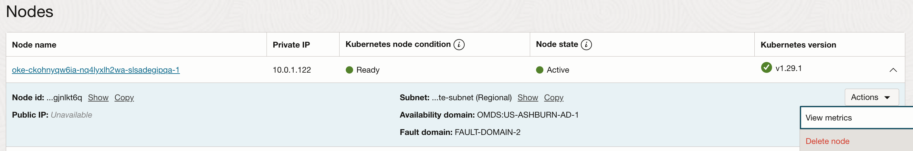
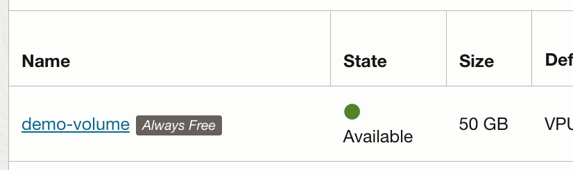

# OKE Up & Running series
* [Part 1](): Signing up for Oracle Cloud
* [Part 2](): Deploy the infrastructure
* [Part 3](): Day-2 Operations (You are here)
***
# Day-2 Operations in OKE
Now that we have our cluster up and running we can start deploying whatever we want to it!

There are a few more things to be aware of if you're trying to avoid spending any money on the cluster, which I'll lay out in this article. Most of these are based on things I ran into myself when I first built my cluster, so there's a chance you might discover surprises that won't be covered here. I'll assume you have a basic knowledge of core Kubernetes concepts wherever they come into play. 

## Arm instances
Assuming that you used Arm instances for your worker node pool to get the most resources possible in your cluster, the only thing you need to look out for is making sure any workloads you deploy use container images that support Arm architectures. Luckily, most popular tools that you'll run into support multi-architecture images these days, so you'll likely only have a problem if you're building your own images and accidentally build them for only `linux/amd64` architectures, or if you use a less common image published by someone else.

If you do deploy something that doesn't support Arm architecture, you'll be able to tell because the pod will have the `CrashLoopBackOff` status, and you'll see errors like this in the logs:
```
> kubectl logs test
exec /bin/bash: exec format error
```

## Upgrading the cluster
Over time you'll want to upgrade your cluster as new Kubernetes versions are released. Oracle has documentation around best practices for doing these upgrades.[^1] The important details to know are:

* The control plane (the actual OKE cluster) has to be upgraded BEFORE the worker nodes.
* The control plane has to be upgraded one minor version at a time. For example, if you want to upgrade from 1.27 to 1.29 you must first upgrade to 1.28, then to 1.29.
* The node pool/worker nodes K8s version can only differ from the control plane version by 3 minor versions (2 if your cluster version is <1.28). So in the previous example, you can upgrade your control plane from 1.27 > 1.28 > 1.29 and then upgrade the workers from 1.27 > 1.29 directly.
[^1]: https://docs.public.oneportal.content.oci.oraclecloud.com/en-us/iaas/Content/ContEng/Concepts/contengaboutupgradingclusters.htm

When you upgrade the node pool, it will not automatically upgrade your existing nodes. If you currently have the maximum number of nodes/resources permitted by the Always Free limits, you'll want to manually cycle your nodes one at a time to avoid exceeding these limits. Fortunately this is easy to do in the OKE web console.

1. If you haven't already, upgrade your control plane and node pool following the guidelines I described above. It's also a good idea at this time to update your node image if a newer one is available.
2. In the OCI console navigate to the OKE console and click on your cluster.
3. From the "Resources" sidebar select "Node pools", and then click your node pool.
4. In the list of active nodes it will tell you which ones are running an out-of-date version of Kubernetes.
5. Click the arrow next to one of the outdated nodes to expand its details, and then click `Actions > Delete Node`. Click "Delete" to confirm. This will trigger all of the pods on that node to drain and restart on the other nodes in your cluster. Once they have all been drained it will delete the node and automatically start deploying a new one. The new node will take 10-15 minutes to become Ready. Once it's ready you can repeat this process for the remaining outdated nodes.


OKE offers more automated or safer ways of doing this, like creating a new node pool so that you can slowly migrate off of the old one and then delete it, but these are likely to end up costing you money since you're temporarily running twice as many nodes, albeit for a pretty short time.

## Load balancers & Ingress
### Specifying the load balancer type
The typical way to publicly expose services running your Kubernetes cluster is with a `Service` of `type: LoadBalancer`, or an Ingress controller. Most managed Kubernetes clusters come with a load balancer controller that handles automatically deploying and configuring a load balancer in your cloud account when you create a Service of this type. While it's easiest to create a separate `LoadBalancer` service for every service you want to expose, this can cost a lot of money since you are charged for each Load Balancer you use.

We can limit the number of load balancers we need by using an Ingress Controller. Without getting too much into the weeds of how they work, the idea is that we create a single load balancer exposing the ingress controller, and then the ingress controller acts as a reverse proxy, using `Ingress` resources to configure hostnames and routes to forward traffic to different services in your cluster. There are many different ingress controllers available, so I won't describe how to install and configure one here, but the important part I want to focus on here is how we configure the `Service` that it uses.

If you go back and review the services included in the OCI Always Free offerings, you'll notice we get one "Flexible Load Balancer" and one "Network Load Balancer". By default, when you create a load balancer via a Kubernetes Service, it will create a Flexible Load Balancer with maximum bandwidth of 400Mbps. However, you'll notice that the only way to get a free Flexible Load Balancer is to limit the minimum and maximum bandwidth to 10Mbps. Instead of doing that, we want to use a Network Load Balancer for better performance while still not costing anything.

We can override the default configuration of load balancers created in Kubernetes with annotations on the Service resource. [This page](https://docs.oracle.com/en-us/iaas/Content/ContEng/Tasks/contengcreatingloadbalancer_topic-Summaryofannotations.htm) has a list of all possible annotations available. If you scroll down to the **Annotations for Network Load Balancers** section, you'll see that by adding the annotation `oci.oraclecloud.com/load-balancer-type: "nlb"` to the Ingress controller's service, it will force the load balancer controller to provision a Network Load Balancer instead of a Flexible Load Balancer. Once you apply this service you can check in the OCI console under `Networking > Load Balancers > Network load balancers` to confirm it was created correctly. You can also check your `Service` in your cluster and confirm that it shows a public IP address (OCI public load balancers get both public and private IP addresses assigned).


```
apiVersion: v1
kind: Service
metadata:
  annotations:
    oci.oraclecloud.com/load-balancer-type: nlb
  name: sandbox-oci-ingress-nginx-controller
  namespace: ingress-nginx
spec:
  type: LoadBalancer
  externalTrafficPolicy: Local
  ports:
  - appProtocol: http
    name: http
    port: 80
    protocol: TCP
    targetPort: http
  - appProtocol: https
    name: https
    port: 443
    protocol: TCP
    targetPort: https
  selector:
    app.kubernetes.io/component: controller
    app.kubernetes.io/instance: sandbox-oci-ingress-nginx
    app.kubernetes.io/name: ingress-nginx
```
```
> kubectl get service -n ingress-nginx sandbox-oci-ingress-nginx-controller
NAME                                   TYPE           CLUSTER-IP      EXTERNAL-IP                PORT(S)                      AGE
sandbox-oci-ingress-nginx-controller   LoadBalancer   10.96.109.253   10.0.0.119,1.2.3.4         80:30097/TCP,443:31664/TCP   153d
```

Note that if you want your load balancer to only be accessible internally (e.g. over a VPN) you'll need to add the appropriate annotation as well.

### external-dns
[external-dns](https://github.com/kubernetes-sigs/external-dns) is a great tool for automatically creating DNS records based on Service or Ingress resources that you create in your cluster. If you use a public load balancer to expose your services, there is one small quirk you'll probably notice - when you specify a Service of type `LoadBalancer` in OKE and use a Network Load Balancer, it'll assign it both a public and internal IP address. When external-dns creates A records it will creating them pointing at both IPs. You'll probably want to configure it to ignore your internal IP range to avoid any confusion. You simply need to add the `--exclude-target-net=10.0.0.0/16` argument to your external-dns Deployment (where `10.0.0.0/16` is the CIDR range of your VCN).[^2]
[^2]: https://github.com/kubernetes-sigs/external-dns/blob/master/docs/faq.md#how-do-i-specify-that-i-want-the-dns-record-to-point-to-either-the-nodes-public-or-private-ip-when-it-has-both

## IAM
If you want any of your workloads to be able to interact with other OCI services, like their Object Storage service, you have to create and assign the necessary permissions. The main disadvantage to using a Basic OKE cluster instead of Enhanced is that you don't get to use Workload Identity[^3] with your workload Service Accounts. Instead you have to assign broad permissions to your worker nodes. This means that all pods running in your cluster get the same permissions to OCI Services, whether they need them or not. In a real-world, production environment this can be a security concern, but for testing purposes it's a tradeoff I'm willing to make. Also, this only really applies if you're integrating with other OCI services.
[^3]: https://blogs.oracle.com/cloud-infrastructure/post/oke-workload-identity-greater-control-access

## Storage
At times you might need persistent storage for your workloads. Always Free includes 200GB of free block storage (up to 5 volumes total), which sounds pretty good until you realize this includes the boot volumes on each of your worker nodes, which can't be smaller than 46GB. That means that if you have 4 worker nodes, you've already used up all of the free block storage available to you (since additional block volumes must be at least 50GB). This is why I recommended leaving the node pool boot volumes at the default size in Part 2. Unfortunately this means that unless you're willing to spend *some* money you are probably out of luck when it comes to using `PersistentVolumes` in your cluster.

This also means that even though you get up to 4 Arm instances and 2 x86 AMD instances, if you have all 6 instances created at any time you'll be exceeding the 200GB/5 total volume limits and will be charged.

You can easily check if additional volumes you've created are Always Free eligibible in the console by checking that they display an "Always Free" label.



# Wrapping Up
Hopefully you found this series helpful, and it cleared up some of the confusion around the Always Free benefits so you can enjoy playing with your new cluster! If there's anything I missed or that you'd like to see future posts about don't hesitate to drop an Issue or Discussion post in the [repo](https://github.com/bkonicek/bkonicek.github.io) for this blog.
